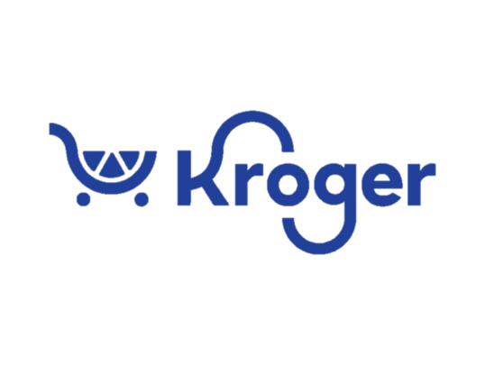

### Hi there 👋
### Hi there, I'm Kyle Lewis 👨‍💻

> a Full Stack Data Analyst and Python Developer

#### 📍 Currently base at: Atlanta, Georgia

#### 💼 Current projects:
<a href="https://github.com/kyle-rgb/Discord_Project"></img></a>

<a href="https://github.com/kyle-rgb/Grocery-Clerk"></img></a>

#### 👨🏻‍💻 Currently working on:

<a href="https://www.javascript.com/"></a>
<a href="https://www.python.org/"></a>
<a href="https://vuejs.org/"></a>
<a href="https://nodejs.org/"></a>
<a href="https://www.tableau.com/products/public"></a>
<a href="https://www.npmjs.com/"></a>
<a href="https://www.w3schools.com/css/"></a>
<a href="https://www.w3schools.com/html/"></a>
<a href="https://getbootstrap.com/"></a>
<a href="https://www.mongodb.com/"></a>
<a href="https://www.postgresql.org/"></a>
<a href="https://mariadb.org/"></a>
<a href="https://visualstudio.microsoft.com/"></a>
<a href="https://github.com/"></a>

#### 🌱 Currently learning ...

<a href="https://www.docker.com/"></a>
<a href="https://airflow.apache.org/"></a>
<a href="https://docs.microsoft.com/en-us/powershell/"></a>
<a href="https://www.linux.org/"></a>


#### My GitHub Stats

[](https://github.com/anuraghazra/github-readme-stats)

### My WakaTime Stats

<!--START_SECTION:waka-->


**🐱 My GitHub Data** 

> 🏆 109 Contributions in the Year 2022
 > 
> 📦 490.4 kB Used in GitHub's Storage 
 > 
> 🚫 Not Opted to Hire
 > 
> 📜 23 Public Repositories 
 > 
> 🔑 1 Private Repository 
 > 
**I'm an Evening 🦉** 

```text
🌞 Morning    23 commits     █░░░░░░░░░░░░░░░░░░░░░░░░   6.93% 
🌆 Daytime    156 commits    ███████████░░░░░░░░░░░░░░   46.99% 
🌃 Evening    149 commits    ███████████░░░░░░░░░░░░░░   44.88% 
🌙 Night      4 commits      ░░░░░░░░░░░░░░░░░░░░░░░░░   1.2%

```
📅 **I'm Most Productive on Monday** 

```text
Monday       66 commits     █████░░░░░░░░░░░░░░░░░░░░   19.88% 
Tuesday      62 commits     ████░░░░░░░░░░░░░░░░░░░░░   18.67% 
Wednesday    51 commits     ███░░░░░░░░░░░░░░░░░░░░░░   15.36% 
Thursday     36 commits     ██░░░░░░░░░░░░░░░░░░░░░░░   10.84% 
Friday       32 commits     ██░░░░░░░░░░░░░░░░░░░░░░░   9.64% 
Saturday     42 commits     ███░░░░░░░░░░░░░░░░░░░░░░   12.65% 
Sunday       43 commits     ███░░░░░░░░░░░░░░░░░░░░░░   12.95%

```


📊 **This Week I Spent My Time On** 

```text
⌚︎ Time Zone: America/New_York

💬 Programming Languages: 
Python                   18 hrs 34 mins      █████████████████░░░░░░░░   71.09% 
Markdown                 3 hrs 35 mins       ███░░░░░░░░░░░░░░░░░░░░░░   13.74% 
JavaScript               53 mins             ░░░░░░░░░░░░░░░░░░░░░░░░░   3.38% 
Text                     50 mins             ░░░░░░░░░░░░░░░░░░░░░░░░░   3.25% 
Other                    40 mins             ░░░░░░░░░░░░░░░░░░░░░░░░░   2.6%

🔥 Editors: 
VS Code                  21 hrs 36 mins      ████████████████████░░░░░   82.71% 
Browser                  4 hrs 18 mins       ████░░░░░░░░░░░░░░░░░░░░░   16.49% 
Excel                    12 mins             ░░░░░░░░░░░░░░░░░░░░░░░░░   0.79%

🐱‍💻 Projects: 
Grocery-Clerk            17 hrs 22 mins      ████████████████░░░░░░░░░   66.46% 
Discord_Project          6 hrs 10 mins       ██████░░░░░░░░░░░░░░░░░░░   23.65% 
kyle-rgb                 1 hr 32 mins        █░░░░░░░░░░░░░░░░░░░░░░░░   5.92% 
Unknown Project          1 hr 2 mins         █░░░░░░░░░░░░░░░░░░░░░░░░   3.97%

💻 Operating System: 
Windows                  26 hrs 8 mins       █████████████████████████   100.0%

```

**I Mostly Code in Jupyter Notebook** 

```text
Jupyter Notebook         17 repos            ████████████████░░░░░░░░░   65.38% 
Python                   3 repos             ███░░░░░░░░░░░░░░░░░░░░░░   11.54% 
JavaScript               3 repos             ███░░░░░░░░░░░░░░░░░░░░░░   11.54% 
HTML                     2 repos             ██░░░░░░░░░░░░░░░░░░░░░░░   7.69% 
VBA                      1 repo              █░░░░░░░░░░░░░░░░░░░░░░░░   3.85%

```


**Languages This Week**

 


 Last Updated on 15/03/2022 18:50:55 UTC
<!--END_SECTION:waka-->

⭐️ From [kyle-rgb](https://github.com/kyle-rgb)

### How to Reach Me : [📫](kylel9815@gmail.com)


<!--
**kyle-rgb/kyle-rgb** is a ✨ _special_ ✨ repository because its `README.md` (this file) appears on your GitHub profile.

Here are some ideas to get you started:

- 🔭 I’m currently working on ...
- 🌱 I’m currently learning ...
- 👯 I’m looking to collaborate on ...
- 🤔 I’m looking for help with ...
- 💬 Ask me about ...
- 📫 How to reach me: ...
- 😄 Pronouns: ...
- ⚡ Fun fact: ...
-->
